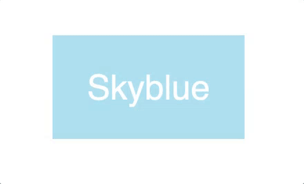

# Small CSS animations series - 01

In these series of exercises you have to replicate a series of elements.

Make an exact copy of the examples and write your own HTML and CSS!

## Before you start

Please copy and paste this code inside your editor:

```html

<html>
    <head>
    <meta charset="UTF-8">
    <meta name="viewport" content="width=device-width, initial-scale=1.0">
    <meta http-equiv="X-UA-Compatible" content="ie=edge">
    <title>Animations - exercise 1</title>
    </head>
<body>

<!-- put your content here -->

</body>

</html>
```

## Animated component:


||
<html>
    <head>
    <meta charset="UTF-8">
    <meta name="viewport" content="width=device-width, initial-scale=1.0">
    <meta http-equiv="X-UA-Compatible" content="ie=edge">
    <title>Animations - exercise 1</title>
    </head>
<body>
<!-- put your content here -->
</body>
</html>