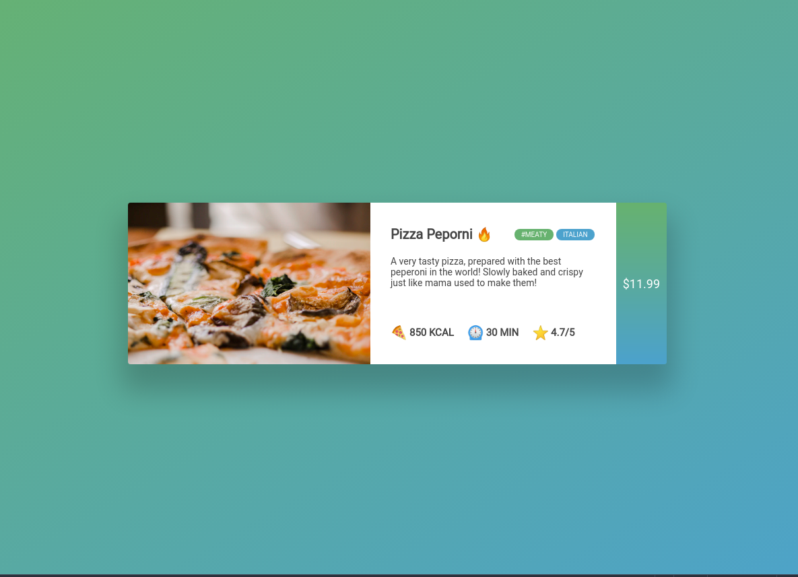

# Flexing card

For this exercise we will not use any set-up code. We gonna refresh your HTML skills!
What are we going to make?

A card that could be used on a application for a pizza delivery service!  🔥🍕⏲️⭐



Colors: 

Green: #444444

Blue: #FFFFFF

Paste this in your editor:

```html
<html>
<head>
    <meta charset="utf-8" />
    <meta name="viewport" content="width=device-width, initial-scale=1.0">
    <meta http-equiv="X-UA-Compatible" content="ie=edge">
    <title>Flex - exercise 1</title>
<style>
/* Put your styling here */
</style>
</head>
<body>
<!-- put your content here -->
</body>
</html>
```

**Tip**: always start with the content: so focus on the html first, without worrying to much about CSS. When your HTML is good, the move on to CSS. This way, you will only add classes when required by the CSS, which is a good practice.
||
<html>
<head>
    <meta charset="utf-8" />
    <meta name="viewport" content="width=device-width, initial-scale=1.0">
    <meta http-equiv="X-UA-Compatible" content="ie=edge">
    <title>Flex - exercise 1</title>
<style>
/* Put your styling here */
</style>
</head>
<body>
<!-- put your content here -->
</body>
</html>