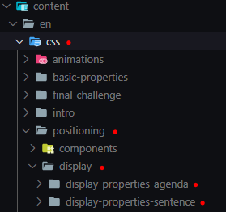

> Please, if you make any changes to the tool - change the documentation accordingly to the changes. 👷🔨

# Code documentation

_Hello world!_ was created in the mindset of using the tool completely offline - Useable and maintainable anywhere in the world.

This means it brings certain limitations with it, but nothing is impossible. The coach or contributors also have to be able to add their own content to list of exercise.

That being said, let's dive into what we use inside this project, and where to find all it's logic.


## Content

- [Tools used in Hello world!](#Tools-used-in-Hello-world!)
   - [Hugo](#Hugo)
   - [CodeMirror](#CodeMirror)
   - [Intro.js](#Intro.js)
 - [Folder structures](#Folder structures)
    - [Content](#Content)
       - [Front-matter](#Front-matter)
    - [Data](#Data)
    - [i18n](#i18n)
    - [Layouts](#Layouts)
       - [_default](#_default)
       - [Partials](#Partials)
       - [ShortCodes](#ShortCodes)
    - [Static folder](#Static folder)

## Tools used in Hello world!

### Hugo


We wanted it to be easy for low/high skilled people to add exercises that they collected. This would mean the process has to be as easy and straightforward as possible (more about this later..). 

All the contributor has to do is create a README file, that contains the instructions/content of the exercise. If the exercise needs an HTML/CSS starters file, they can easily put it next to the README.

Knowing this, we had chosen **Hugo** as our _static site generator_. Hugo generates pages, by looking at the README files and template files.
This way we easily could put the exercises next to each other and Hugo would do the rest.
There are some limitations to this tool, knowing that originally made for blogs - we had to "hack" our way around some certain obstacles.

You can find the Hugo documentation [here](https://gohugo.io/).

### CodeMirror


For our Editor we are using CodeMirror, an easy to setup JavaScript library that will turn text-area in pleasant code editors that are fully customize able!
If you want to dive into the documentation, you can find it [here](https://codemirror.net/)

### Intro.js

In this project there is a little `"Joy-ride"` which navigates the user through the application in case they are lost. For more info look [here](https://introjs.com/docs).


## Folder structures

Hello world is located inside the "Hugo" folder. As you can see there are multiple folders that play an important role. We will cover each folder and the important files in this section.

### Content

Inside the content folder you will find all lectures/exercises, as you can see there are language folders. Each folder will contain the same material, but translated. For now, lets focus on the English folder ('gb').

It is important that each subject, chapter and exercise has its own folder.

Take this for instance:

- gb
  - html
    - basics-of-html
      - boldcusive
        - index.md 
        - style.css
        - exercise.html

You can see that there are 3 files inside the `boldcursive` exercise. 

Let's loop over the main files that could be located inside the exercise folder.

- **index.md** &#8594; Instructions/lecture written in markdown
- **image files** &#8594; Images that are used **Only** inside the Readme
- **style.css** &#8594; The styling that will be used inside the css editor
- **exercise.html** &#8594; The html that will be used inside the html editor
- **script.js** &#8594; The JavaScript that will be used inside the JS editor.
- **Resources folder** &#8594; This folder will contain all resources the junior will use inside their exercises.

> The subject, chapter and exercise folders naming is important, you will see more about this in the "Data" chapter.


#### Front-matter

Hugo uses Front-matter variables that you declare and later use in your HTML (We'll see more about this later.)
Front-matters can be found inside the `index.md`, there are 4 important ones that we HAVE to declare.

- __Title__ &#8594; Instructions/lecture written in markdown
- __Editor__ &#8594; Does the page have an editor? [false/true]
- __Layout__ &#8594; Which layout should the page use? (Currently standard should single.html)
- __TranslationKey__  &#8594; A string that connects translated pages together. Hugo will check if there is a README with the same string. This makes it so people can change language on the page itself.

### Data

For each language there are a series of YAML files, that collects which exercises are located inside the application, if done correctly they will be displayed in the user interface.

> Not assigning the right folders/file names will result in not displaying the exercise in the navigation menu

Let's take a look at the YAML structure from css.yaml

```yaml
---
chapters:
# -------Positioning-------
  positioning: # -----> Just a name to make it clear.
    order: 3   # -----> Will be displayed as the 3rd element in the list.
    folder : positioning # -----> Folder name
    subFolders: true # -----> Are there third level of folders?
    
	# -----> If there are no third levels, list the exercises down here
    exercises:
	# ---> like this
	- intro-to-css 
	# ---> Note, this should not belong here since subfolders is not false.
	
    subChapters:
      1-display: # -----> Just a name to make it clear.
        folder: display # -----> Second level folder name
        exercises:
        - display-properties-agenda  # -----> Third level folder name, aka. the exercise.
        - display-properties-sentence # -----> Third level folder name, aka. the exercise.
```

This will target the following folders:

 

### i18n

For making translations easier, words that need to be translate in the html file can be found here. If done correctly, Hugo will change this for each i18n element that has the same id.

### Layouts

Just like the name gives it away, this is where we build our HTML layouts, those can be pages, components, ... anything that is related to HTML should be written here.

#### _default

Inside the `_default` folder, you will find the important html files that Hugo should use. Currently there are only two files:

- **single.html** &#8594; This is the default layout for all the exercises
- **about.html** &#8594; This is the default about layout

#### Partials

These a HTML snippets/components that you can use within other HTML pages/components.

You can call partials like this : 

```go
{{ partial "navbar" (dict "lang" .Lang "site" .Site "translations" .Translations)}}
```

> Note: dict is used to pass more than one value to the partial template.

#### ShortCodes

Shortcodes are HTML snippets that can be used inside your markdown files. If certain elements need a styling for example centering and image.


### Static folder

Inside the static folder you will find all static files like images, css , JavaScript, ...


