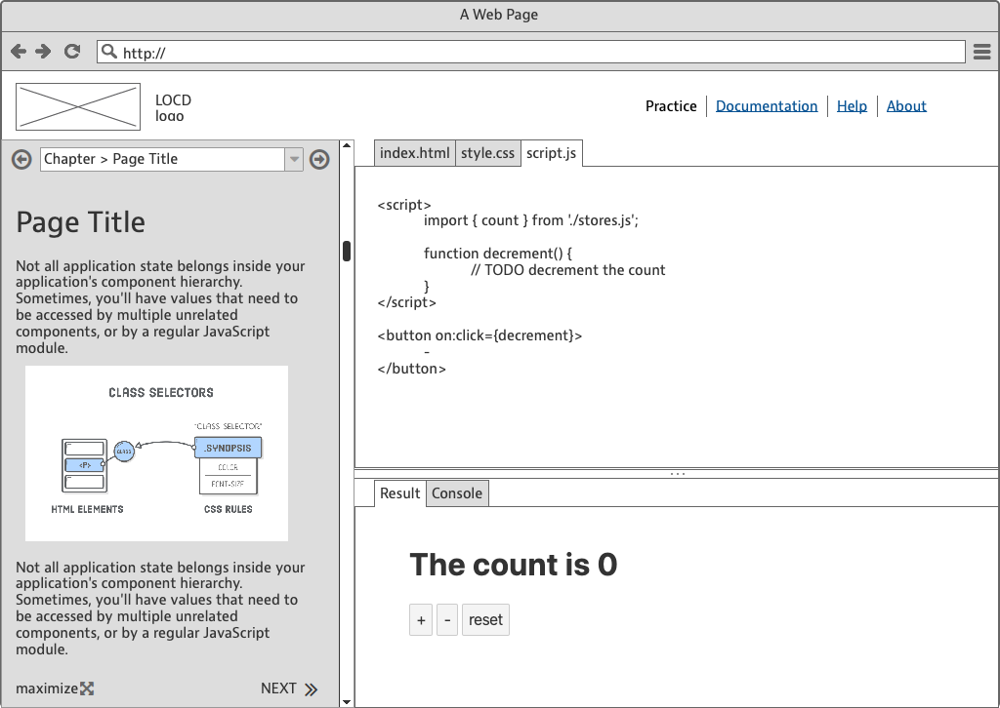

# Project: LOCD: Learn Offline Coding  by Doing

LOCD (pronounce `Hello SeeDee!`) is a tool to generate an offline RPL (Read-Eval-Print-Loop) application to learn frontend coding by ... coding !

The tool aims at allowing people with no coding background to learn html, css and javascript, in a mostly "learning by doing" methodology. The final objective is to help them taste coding and decide if frontend development is something they would like to pursue as a professional career.

## Strictly offline

 The tool is targeting training contexts where there is poor or no access to the internet and particularly: remote areas, refugee camps and prisons. 

The client machine should be a simple computer with a fairly recent browser.

The delivery mode must be either :

- a  USB Key containing the Browser Setup package and the LCDO web application (package as a folder containing only static html, css and javascript files, along with static assets like audio, video, images and fonts).

- a html5 package, as a zip, available to be used on kolibri Studio

## Example

- Svelte online Tutorial: [https://svelte.dev/tutorial/](https://svelte.dev/tutorial/) : it contains the entire learning material and presents it next to a "practice" zone. Having both theory and exercise in the same screen is very cognitively efficient and it encourages the learner to try directly. Unfortunately, the tool requires a local server to run. [See the Code]([https://github.com/sveltejs/svelte/tree/master/site](https://github.com/sveltejs/svelte/tree/master/site)).

## 2 Target audiences

### Learner UX

Learner wants to learn coding by doing in order to one day become a frontend integrator. The screen is 90% similar to Svelte Tutorial . There is a "theory/instructions" zone on the left, and the right is divided with above: the code editor, and below, the code renderer, including a console.

How is this different to Svelte ?

- there is a maximize button allowing to give the entire space to the Theory/Instructions zone. [See Mockup](./study/ux/LOCD-LUX.pdf)
- no backend necessary

### Trainer UX

**Trainer wants to write content (theory and exercises) efficiently and rapidly.**

Trainer has at least junior-level coding knowledge and can follow instructions to "build" the application.

The Trainer's UX will mostly be 

- to create a folder structure and add content to it using MarkDown. 

- to preview its work, (s)he should run a command that parses the content and re-generates LOCD html+css+javascript code into a standalone folder - ready for the testing.

- to deliver its work, trainer must "build" the package as a zip file, ready for Kolibri Studio.

## The solution

### 1. Content

The right way to structure the markdown so that the system can infer the course internal structure (Chapter > Pages) is probably to have each chapter as a folder, and each page as a chapter sub-folder.

### 2. Template

see prototype above. How to build it will depend on the chosen SSG. Just keep in mind that it must not need a local server (no npm, no node, no ... ). It must run as "file://" urls.

### 3. Static Site Generator

We need a **Static Site Generator** tool that can use an html file (for the code editor template) and the chapter pages as markdown files (for the content) as inputs, and outputs as many html pages as there are chapters in the lesson.

Each html page will need to have the navigation arrows populated with links to the previous/next page. It will also need to have the dropdown populated with as many `<option>`tags as there are pages in the lesson.

- [Hugo]([https://gohugo.io/](https://gohugo.io/) ?

- [Mixu MD Styles](https://github.com/mixu/markdown-styles) ?
